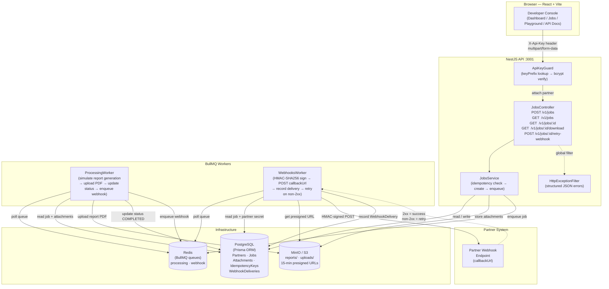
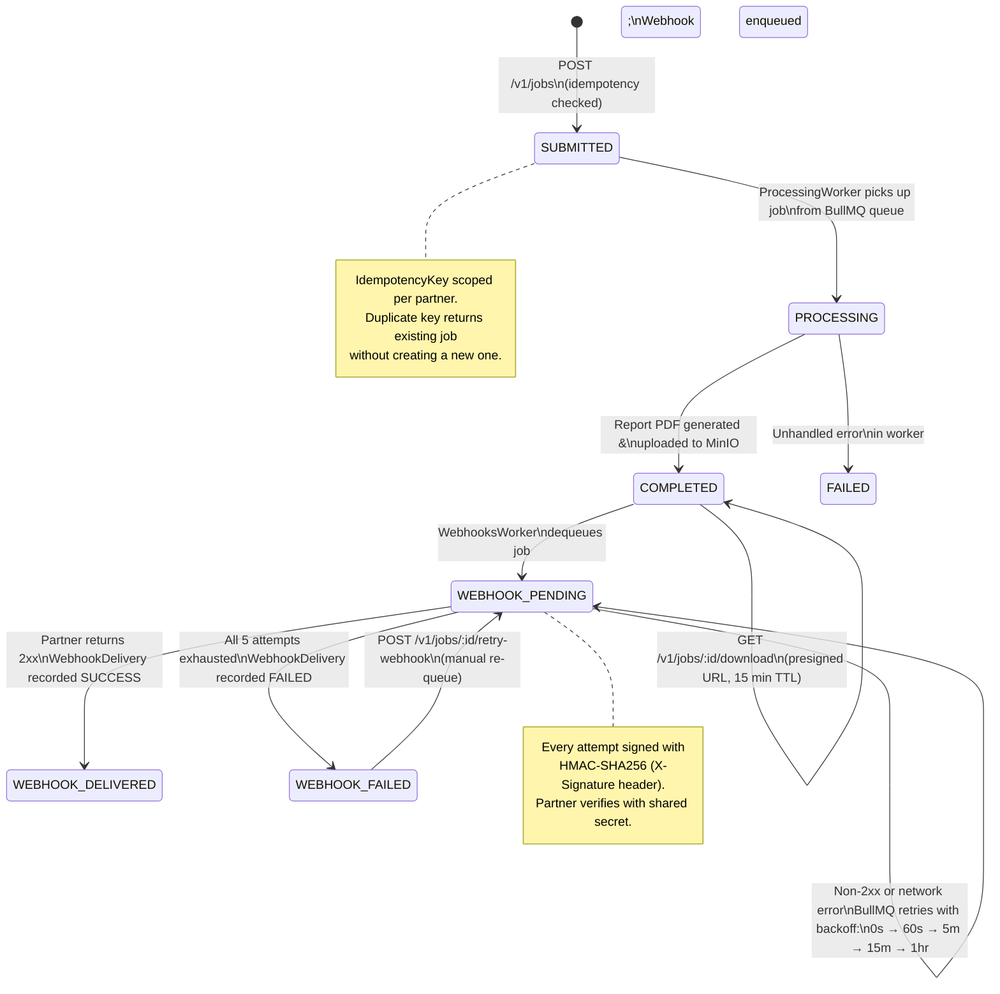
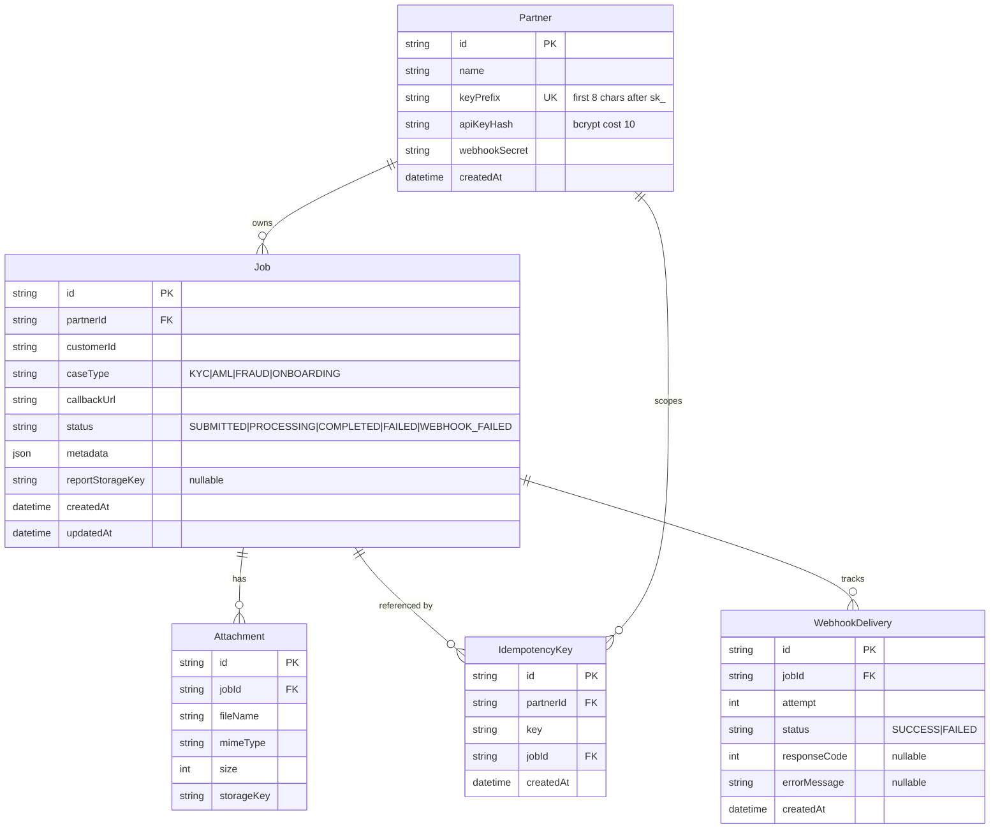

# Architecture Diagrams

## System Overview

```mermaid
graph TB
    subgraph Client["Browser — React + Vite"]
        UI["Developer Console\n(Dashboard / Jobs / Playground / API Docs)"]
    end

    subgraph Gateway["NestJS API  :3001"]
        direction TB
        Guard["ApiKeyGuard\n(keyPrefix lookup → bcrypt verify)"]
        JC["JobsController\nPOST /v1/jobs\nGET  /v1/jobs\nGET  /v1/jobs/:id\nGET  /v1/jobs/:id/download\nPOST /v1/jobs/:id/retry-webhook"]
        JS["JobsService\n(idempotency check → create → enqueue)"]
        EF["HttpExceptionFilter\n(structured JSON errors)"]
    end

    subgraph Workers["BullMQ Workers"]
        PW["ProcessingWorker\n(simulate report generation\n→ upload PDF → update status → enqueue webhook)"]
        WW["WebhooksWorker\n(HMAC-SHA256 sign → POST callbackUrl\n→ record delivery → retry on non-2xx)"]
    end

    subgraph Infra["Infrastructure"]
        PG[("PostgreSQL\n(Prisma ORM)\nPartners · Jobs\nAttachments · IdempotencyKeys\nWebhookDeliveries")]
        RD[("Redis\n(BullMQ queues)\nprocessing · webhook")]
        S3[("MinIO / S3\nreports/ · uploads/\n15-min presigned URLs")]
    end

    subgraph Partner["Partner System"]
        CB["Partner Webhook\nEndpoint\n(callbackUrl)"]
    end

    UI -->|"X-Api-Key header\nmultipart/form-data"| Guard
    Guard -->|"attach partner"| JC
    JC --> JS
    JS -->|"read / write"| PG
    JS -->|"store attachments"| S3
    JS -->|"enqueue job"| RD
    JC -.->|"global filter"| EF

    PW -->|"poll queue"| RD
    PW -->|"read job + attachments"| PG
    PW -->|"upload report PDF"| S3
    PW -->|"update status COMPLETED"| PG
    PW -->|"enqueue webhook"| RD

    WW -->|"poll queue"| RD
    WW -->|"read job + partner secret"| PG
    WW -->|"get presigned URL"| S3
    WW -->|"HMAC-signed POST"| CB
    WW -->|"record WebhookDelivery"| PG

    CB -.->|"2xx = success\nnon-2xx = retry"| WW
```

---

## Job Lifecycle & State Machine

```mermaid
stateDiagram-v2
    [*] --> SUBMITTED : POST /v1/jobs\n(idempotency checked)

    SUBMITTED --> PROCESSING : ProcessingWorker picks up job\nfrom BullMQ queue

    PROCESSING --> COMPLETED : Report PDF generated &\nuploaded to MinIO;\nWebhook enqueued

    PROCESSING --> FAILED : Unhandled error\nin worker

    COMPLETED --> COMPLETED : GET /v1/jobs/:id/download\n(presigned URL, 15 min TTL)

    COMPLETED --> WEBHOOK_PENDING : WebhooksWorker\ndequeues job

    WEBHOOK_PENDING --> WEBHOOK_DELIVERED : Partner returns 2xx\nWebhookDelivery recorded SUCCESS

    WEBHOOK_PENDING --> WEBHOOK_PENDING : Non-2xx or network error\nBullMQ retries with backoff:\n0s → 60s → 5m → 15m → 1hr

    WEBHOOK_PENDING --> WEBHOOK_FAILED : All 5 attempts exhausted\nWebhookDelivery recorded FAILED

    WEBHOOK_FAILED --> WEBHOOK_PENDING : POST /v1/jobs/:id/retry-webhook\n(manual re-queue)

    note right of SUBMITTED
        IdempotencyKey scoped per partner.
        Duplicate key returns existing job
        without creating a new one.
    end note

    note right of WEBHOOK_PENDING
        Every attempt signed with
        HMAC-SHA256 (X-Signature header).
        Partner verifies with shared secret.
    end note
```

---

## Data Model

```mermaid
erDiagram
    Partner {
        string id PK
        string name
        string keyPrefix UK "first 8 chars after sk_"
        string apiKeyHash "bcrypt cost 10"
        string webhookSecret
        datetime createdAt
    }

    Job {
        string id PK
        string partnerId FK
        string customerId
        string caseType "KYC|AML|FRAUD|ONBOARDING"
        string callbackUrl
        string status "SUBMITTED|PROCESSING|COMPLETED|FAILED|WEBHOOK_FAILED"
        json metadata
        string reportStorageKey "nullable"
        datetime createdAt
        datetime updatedAt
    }

    Attachment {
        string id PK
        string jobId FK
        string fileName
        string mimeType
        int size
        string storageKey
    }

    IdempotencyKey {
        string id PK
        string partnerId FK
        string key
        string jobId FK
        datetime createdAt
    }

    WebhookDelivery {
        string id PK
        string jobId FK
        int attempt
        string status "SUCCESS|FAILED"
        int responseCode "nullable"
        string errorMessage "nullable"
        datetime createdAt
    }

    Partner ||--o{ Job : "owns"
    Job ||--o{ Attachment : "has"
    Job ||--o{ IdempotencyKey : "referenced by"
    Partner ||--o{ IdempotencyKey : "scopes"
    Job ||--o{ WebhookDelivery : "tracks"
```
